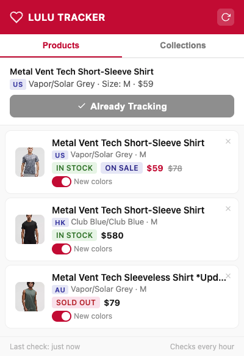
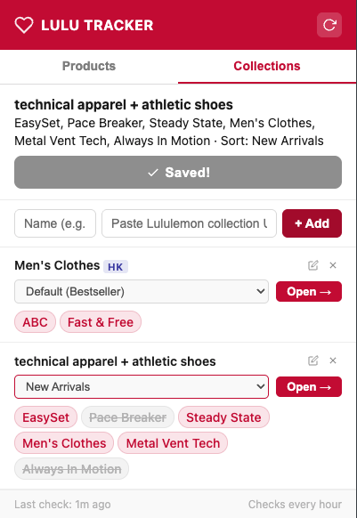
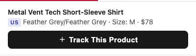
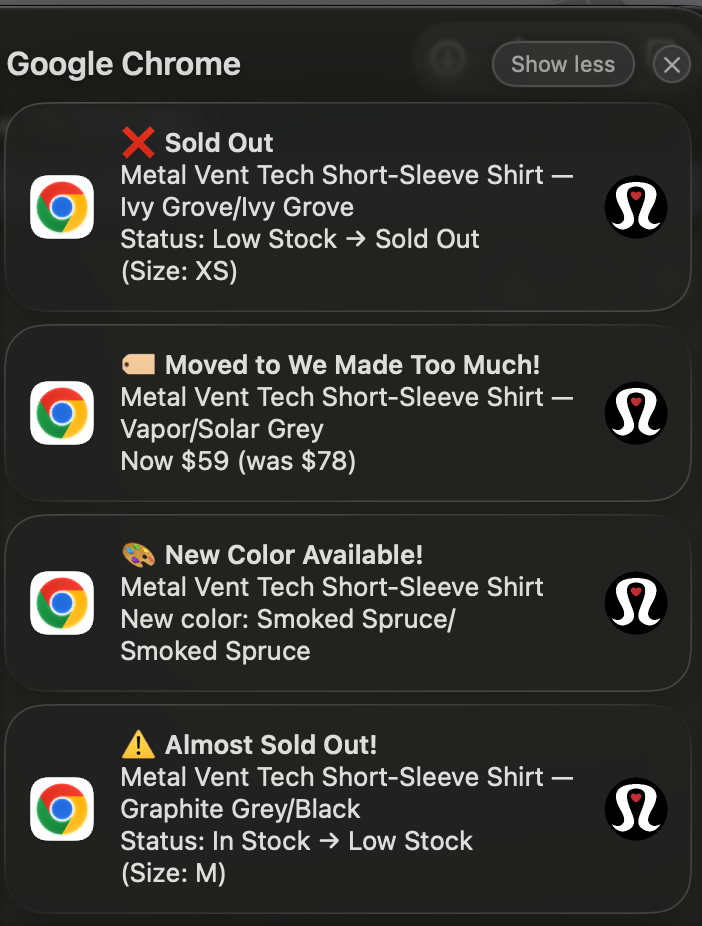

# Lululemon Product Tracker — Chrome Extension

A Chrome extension that tracks Lululemon product availability, price changes, stock status, and new color releases across **9 regions**. Get desktop & Discord notifications when something changes — never miss a restock or price drop again.

  

---

## Features

### Product Tracking & Notifications

| Event | Notification |
|---|---|
| Low Stock | "Only a few left!" detected for your size |
| Sold Out | Your tracked product/size is no longer available |
| Back in Stock | A previously sold-out item is available again |
| Price Drop | Price decreased (shows old to new price) |
| Went on Sale | Product moved to markdown / sale section |
| New Color | A new color appeared for a product line you track |
| Size Change | Specific sizes go in/out of stock |
| Discontinued | Product returns 404 for 3 consecutive checks |

### Multi-Region Support (9 Regions)

| Region | Code | Store URL | Framework | Currency |
|---|---|---|---|---|
| United States | `us` | `shop.lululemon.com` | Next.js | USD |
| Canada | `ca` | `shop.lululemon.com/en-ca` | Next.js | CAD |
| Hong Kong | `hk` | `www.lululemon.com.hk` | SFCC | HKD |
| Australia | `au` | `www.lululemon.com.au` | SFCC | AUD |
| Japan | `jp` | `www.lululemon.co.jp` | SFCC | JPY |
| South Korea | `kr` | `www.lululemon.co.kr` | SFCC | KRW |
| United Kingdom | `uk` | `www.lululemon.co.uk` | SFCC | GBP |
| France | `fr` | `www.lululemon.fr` | SFCC | EUR |
| Vietnam | `vn` | `www.lululemon.com.hk/en-vn` | SFCC | VND |

### Quick Add by Product Code + Color Code

The fastest way to track a product across all regions:

1. Enter the **product code** (e.g. `835113`) and **color code** (e.g. `32493`)
2. The extension automatically builds the correct URL for each region
3. Click **"Track All Regions"** to scan all 9 regions in parallel
4. Regions where the product exists are automatically added; regions where it doesn't (404) are silently skipped
5. Real-time URL preview shows how the URL will look before you submit

> The product code can be entered with or without the `prod` prefix — the extension auto-completes it.

### Discord Webhook Notifications

Receive instant Discord notifications for any tracked product changes:

- **Per-region webhook configuration** — set a different Discord channel for each region
- **Rich embeds** — product image, price, stock status, available sizes (sorted), region tag, and timestamp
- **Initial notification** — sent when a product is first added to tracking
- **Change notifications** — restock, sold out, price drop, on sale, new colors, size changes, WMTM transfer
- **Rate-limit aware** — respects `retry-after` headers, spaces out multi-region notifications

### Cross-Region Price Comparison

Click the compare button on any product card to see prices across all 9 regions:

- Fetches prices from all regions in parallel
- Shows both native currency and converted price
- Highlights the cheapest region in green
- Choose your comparison currency (USD, HKD, AUD, JPY, KRW, GBP, CAD, EUR, VND)
- Exchange rates cached for 24 hours (via `open.er-api.com`)

### Price History

- Records every price change with timestamp
- Shows price trend arrows (up / down) on the product card
- Highlights all-time lowest price with a gold badge
- Hover to see the last 5 price records

### Collection Shortcuts

Save your favorite filtered collection URLs as quick-access shortcuts:
- Save the current collection page with one click
- Toggle individual filters on/off to rebuild URLs dynamically
- Change sort method per collection
- Region-aware: different sort options per region

### Other Features

- **Badge count** on extension icon — shows how many products need attention
- **Per-product new color toggle** — enable/disable new color tracking per item
- **Change highlighting** — recently changed products get visual indicators (red border + pulse dot)
- **SPA navigation detection** — auto-refreshes when you switch color/size on the page
- **Privacy-first** — all data stays local, nothing sent to any server (except Discord webhooks you configure)
- **Size sorting** — all size displays are sorted from smallest to largest (XS to XXL, or numeric 0 and up)

---

## Screenshots

### Products Tab
<!-- Screenshot: The popup showing tracked products with status badges, prices, and region tags -->


### Collections Tab
<!-- Screenshot: The collections tab with saved collections, filter chips, and sort dropdown -->


### Tracking a Product
<!-- Screenshot: Being on a Lululemon product page with the popup open showing "Track This Product" button -->


### Desktop Notification
<!-- Screenshot: A macOS/Windows notification showing a stock or price alert -->


---

## Installation

1. **Download** this repository:
   - Click the green **"Code"** button -> **"Download ZIP"**, or
   - `git clone https://github.com/YOUR_USERNAME/lululemon-tracker.git`

2. **Unzip** the downloaded file (if using ZIP)

3. Open Chrome and go to `chrome://extensions/`

4. Enable **Developer mode** (toggle in the top-right corner)

5. Click **"Load unpacked"**

6. Select the `lululemon-tracker` folder

7. **Pin the extension** — click the puzzle piece icon in your toolbar -> find "Lululemon Product Tracker" -> click the pin icon

> **Enable notifications:** Go to `chrome://settings/content/notifications` and make sure Chrome is allowed. On **macOS**, also check System Settings -> Notifications -> Google Chrome -> Allow.

---

## How to Use

### Track a Product by Code (Recommended)

1. Click the extension icon -> stay on the **Products** tab
2. Enter the **product code** (e.g. `835113`) and **color code** (e.g. `32493`)
3. The URL preview updates in real-time
4. Click **"Track All Regions"**
5. The extension scans all 9 regions — products that exist are added, missing ones are skipped
6. Results show which regions were successfully added

### Track a Product from a Page

1. Visit any product page on a supported Lululemon store
2. **Select your color and size** on the page
3. **Click the extension icon** in your toolbar
4. You'll see a preview of the detected product -> click **"Track This Product"**
5. Done! The extension checks on your configured interval automatically
6. Click the refresh button anytime to force an immediate check

### Configure Discord Notifications

1. Click the extension icon -> switch to the **Settings** tab
2. For each region you want notifications for, paste your Discord webhook URL
3. Changes are saved automatically
4. Configured webhooks get a green border visual indicator

### Compare Prices Across Regions

1. On any tracked product card, click the **compare button** (globe icon)
2. Prices from all 9 regions are fetched and displayed
3. The cheapest region is highlighted in green
4. Use the currency dropdown to switch conversion currencies

### Save a Collection

1. Browse to a **filtered collection page** (e.g. Men's -> Metal Vent Tech + Pace Breaker)
2. Click the extension icon -> switch to the **Collections** tab
3. Click **"Save This Collection"**, or paste a URL manually
4. Your collection appears as a card with:
   - **Filter chips** — click any chip to toggle it on/off
   - **Sort dropdown** — change sort method (region-specific options)
   - **Open ->** — opens the rebuilt URL with your active filters

### Understand the Status Badges

| Badge | Meaning |
|---|---|
| Green `IN STOCK` | Available in your tracked color/size |
| Yellow `LOW STOCK` | "Only a few left!" — act fast |
| Red `SOLD OUT` | Unavailable in your tracked color/size |
| Purple `ON SALE` | Price reduced or moved to markdown |
| Region tags `US` `HK` etc. | Which regional store this product is from |
| Gray `DISCONTINUED` | Product returns 404 |

---

## Testing

### Verify Installation

1. Open `chrome://extensions/` -> find the extension -> click **"Service Worker"**
2. You should see: `[LuluTracker] Extension installed. Alarm set.`

### Test Notifications

Run this in the Service Worker console:

```js
chrome.notifications.create('test', {
  type: 'basic',
  iconUrl: 'icons/icon128.png',
  title: 'Almost Sold Out!',
  message: 'Metal Vent Tech SS Shirt — Vapor/Solar Grey\nSize: M',
  priority: 2,
  requireInteraction: true,
});
```

### Inspect Tracked Data

```js
chrome.storage.local.get('trackedProducts', d => console.log(d))
```

---

## Project Structure

```
lululemon-tracker/
├── manifest.json      # Extension config (permissions, domains, icons)
├── background.js      # Service worker: scheduled checks, fetch, parsing, Discord notifications
├── content.js         # Injected into product pages: extracts product data from DOM & JSON
├── popup.html         # Extension popup layout (Products + Collections + Settings tabs)
├── popup.css          # Styling (Lululemon-inspired theme)
├── popup.js           # Popup logic: product list, quick add, collections, settings, price comparison
└── icons/
    ├── icon16.png     # Toolbar icon
    ├── icon48.png     # Extensions page icon
    └── icon128.png    # Install dialog icon
```

### Data Sources

| Site | Framework | Primary Data Source | Stock Detection |
|---|---|---|---|
| US / CA | Next.js | `__NEXT_DATA__` JSON | SKU availability + server-rendered warnings |
| HK / AU / JP / KR / UK / FR / VN | Salesforce Commerce Cloud (SFCC) | JSON-LD `ProductGroup` | `offers.availability` + visible low-stock banners + `markdown-prices` class |

### How Background Checking Works

```
On configured interval:
  For each tracked product:
    1. Fetch the product page URL
    2. Parse structured data (__NEXT_DATA__ or JSON-LD)
    3. Extract: price, stock status, available colors, available sizes
    4. Compare with stored state (detectChanges)
    5. Send desktop notification + Discord webhook if anything changed
    6. Update badge count on extension icon
```

### URL Patterns

The extension supports two URL formats:

- **Next.js (US/CA)**: `https://shop.lululemon.com/p/~/~/_/prod{code}?color={code}`
- **SFCC (International)**: `https://www.lululemon.{tld}/{locale}/p/~/prod{code}.html?dwvar_prod{code}_color={code}`

The `~` wildcard in URLs is a placeholder — the server automatically redirects to the canonical URL with the real category/product slug.

---

## Important Notes

- **Selectors may break** — If Lululemon redesigns their site, CSS selectors and data structures may change. The extension uses multiple fallback strategies (JSON-LD, regex, meta tags).
- **Rate limiting** — One `fetch()` per product per check interval. Tracking ~50 products across 9 regions is fine.
- **Privacy** — All data stored locally in `chrome.storage.local`. No data is sent to any external server except Discord webhooks you explicitly configure.
- **Color code matching** — International (SFCC) sites use color codes in URLs (e.g. `color=32493`) but color names in JSON-LD (e.g. `"Black"`). The extension handles this mismatch with smart fallbacks.

---

## Disclaimer

This extension is a personal project for learning and personal use only.

- This extension is **not affiliated with**, endorsed by, or associated with lululemon athletica inc.
- "lululemon" and all related trademarks are the property of lululemon athletica inc.
- This tool only reads publicly available web page data. It does not bypass any access restrictions or authentication mechanisms.
- All data is stored locally in the user's browser (`chrome.storage.local`). **No data is sent to any external server** (except Discord webhooks you configure).
- The author assumes no responsibility for any losses resulting from the use of this tool, including but not limited to: missed restocks, delayed or incorrect price change notifications, etc.
- Use at your own risk.
- This extension may stop working if lululemon changes their website structure.

---

## License

MIT License — feel free to fork, modify, and share.